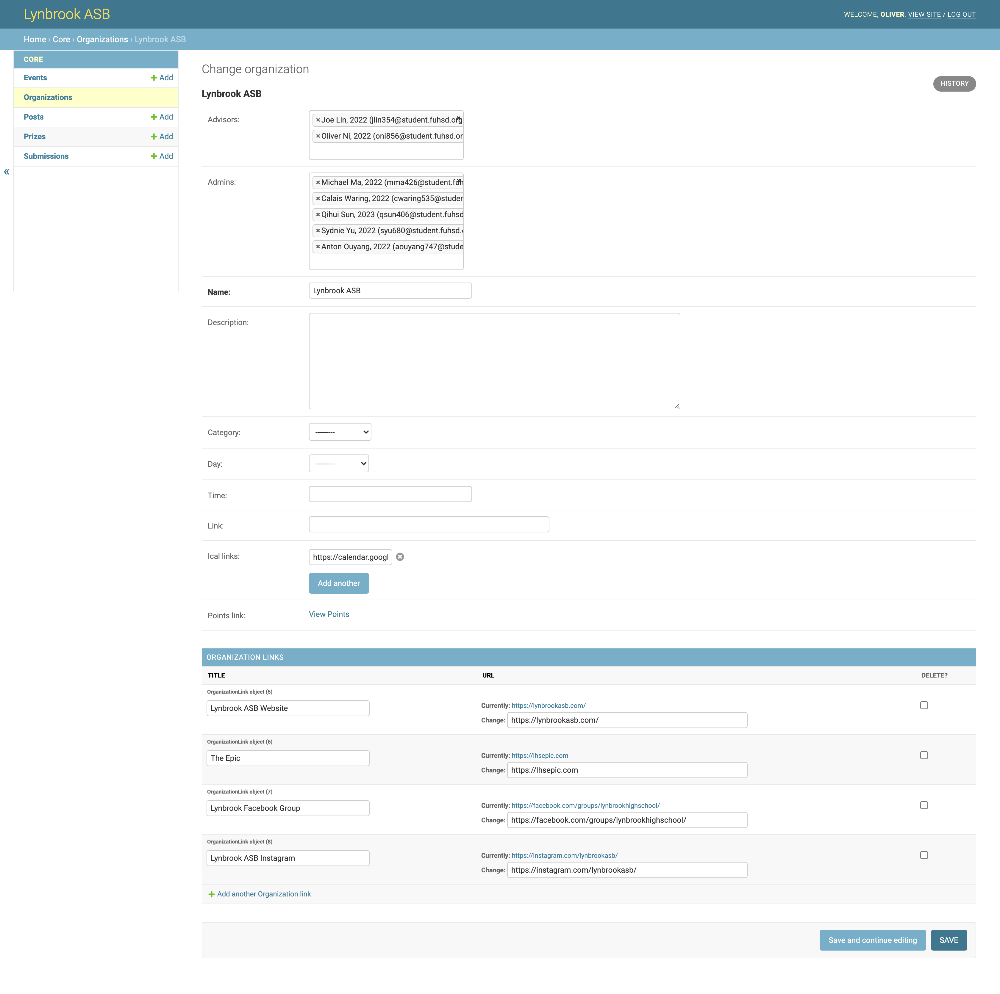
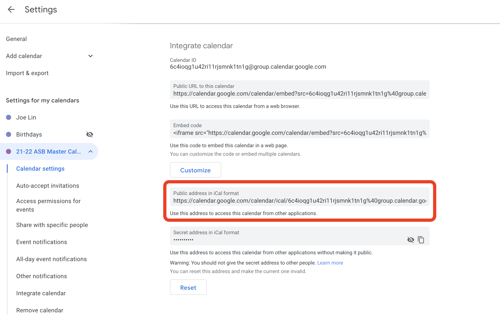

# Admin Panel Instruction Manual

Welcome to the Lynbrook App Admin Panel Instruction Manual!

This document outlines some of the features of the app and how to use them. This document is meant to be viewed by club officers and advisors, ASB members, and staff, but if you're not one of those, that's fine too :)

For a table of contents, feel free to press the list button on the top left.

If you have any questions, please contact one (or both) of the following people:

- Oliver Ni, Lead App Developer
  - oliver.ni@gmail.com
  - Instagram: [mcparadip](https://www.instagram.com/mcparadip/)
  - Discord: Oliver#0001
- Joe Lin, ASB President
  - lin0joe24@gmail.com
  - Instgram: [joe.2022.lin](https://www.instagram.com/joe.2022.lin/)
  - Discord: 💻☕#4494

## Admin Panel Access

Various features of the app can be controlled from the _Admin Panel_. This is a website (outside of the app itself) for club officers and advisors, ASB members, and staff.

This admin panel is available at https://lynbrookasb.org/admin/. You can login with your FUHSD Google Account by clicking the _Sign in with Google_ button. Anyone can login; however, to perform any actions, you must first be added as an admin to at least one _Organization_ (these include ASB, each graduating class, and clubs).

If you've logged onto the app in the past, you've likely already been added as an admin to any clubs you're an officer of. If you haven't, please let one of us know (contact information is at the top of the document) so we can add you.

## Organization Management

You can manage general information about any of the Organizations you're a part of on the [_Organizations_](https://lynbrookasb.org/admin/core/organization/) tab.



There are a couple fields here you can edit:

**Advisors/Admins.** Only advisors can edit other advisors, while both advisors and admins can edit admins. To add someone, start typing their name and autocomplete should pop up. If you can't find a user, that means they haven't logged in to the app yet.

**Name.** The name of the organization as displayed everywhere on the app and in other pages like the points view. Please only make small edits to this field. The name should remain mostly the same.

**Description.** This text block is shown in the clubs tab of the app. We highly recommend filling this out so people can get a basic understanding of your organization if they click on it in the app.

**Category.** _Applicable only to clubs_. Interest, Service, or Competition. You probably do not need to edit this.

**Day.** _Applicable only to clubs_. The day which your club holds regular meetings. This information is displayed on the app's club page.

**Time.** _Applicable only to clubs_. The time period which your club holds regular meetings. This information is displayed on the app's club page.

**Link.** _Applicable only to clubs_. A link to your club's website. This is currently not used anywhere but may be displayed on the app's club page in the future.

**iCal Links.** A link to a public `.ics` file that will be populated in the Events tab on the app for users who have added your club. If you use Google Calendar, you can retrieve a link by heading to the following section in your google calendar settings under _Public address in iCal format_.

_Please double check that you are adding the iCal link corresponding to your organization calendar, not your personal calendar._



**Points Link.** This is not editable, but is simply a link to the publishable points view (see the next section for information about that).

**Organization Links.** These links show on on the Settings page of the app for users who have added your club. Please do not abuse these links.

## Club Attendance & Points

Attendance and points can be tracked through the app. This works through setting up different _events_, which are each worth a certain number of points.

Members can sign into these events in one of the following ways:

- Scanning the auto-generated QR code using the Lynbrook App
- Entering the 6-digit code manually on the Lynbrook App
- Entering the 6-digit code in the web form at lynbrookasb.org

Make sure to add the auto-generated QR code and 6-digit code to your attendance slide!

### Adding Events

To add an event _(e.g. club meetings)_, click the add button on the _Events_ tab. Select your organization in the dropdown menu and fill in the event details in the inputs provided.

There are a couple fields you can edit:

**Organization.** The organization this event is associated with.

**Name.** The name of the event. Will be displayed in the Home tab of the app when it is active for users who have added your club, along with the description and a buton to scan for points.

**Description.** This description shows up along with the name.

**Start.** The starting time of the event. Before this, members will not be able to sign in for points.

**End.** The ending time of the event. After this, members will not be able to sign in for points.

**Points.** The number of points this event is worth.

**Submission Type.** There are two "submission types". The normal one is _Code_, where users sign in by scanning a QR code or entering a numeric one. However, you can also use _File_ if you would like members to submit a photo. (File is mostly meant for ASB, but clubs can use it too.)

_If your event submission type is CODE, click on your event after you save it to obtain the auto-generated QR code and corresponding 6-digit code._

### Viewing Points

A publishable points website is generated based on the events you have created and the members who have signed in. Here, you can see a spreadsheet-like view of the events. Click [here](https://lynbrookasb.org/admin/core/organization/95/points/) to view an example of how this looks.

To view this website, simply navigate to the _Organizations_ tab and click the _View Points_ button next to the club you're looking for.

### Importing Points into Google Sheets

If you have more advanced needs for points that are not covered by the app, you can also import the viewable points spreadsheet into a Google Spreadsheet. This way, you can use formulas or whatever you're used to to manipulate the points.

In order to do so, press the _View Points_ button and copy the URL. Then, append an extra `csv/` to the end of the the URL. Lastly, you can use the `IMPORTDATA` function in Google Sheets to import the CSV file into the spreadsheet like below:

```js
=IMPORTDATA("https://lynbrookasb.org/admin/core/organization/95/points/csv/")
```

It is important to note that **the imported data will be read only.** Trying to overwrite values will simply break the formula. We recommend leaving this imported data alone in its own sheet, and using spreadsheet formulas in a different sheet if you need to do anything advanced.

## Announcements

To post an announcement, click the add button on the _Posts_ tab.

Select your organization and fill in the announcement details in the inputs provided.

There are a couple fields you can edit:

**Organization.** The organization this announcement is associated with.

**Title.** The title of the announcement. This will be displayed on the list of announcements in the _News_ tab of the app.

**Content.** The content of the announcement. This will be displayed in a sub-screen of the announcement.

**Published.** Check the box for your announcement to be published.

**Polls.** Feature coming out soon!
